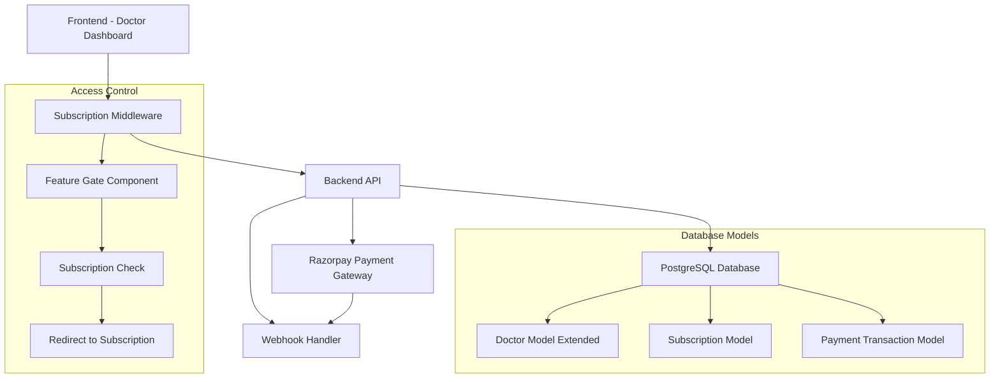
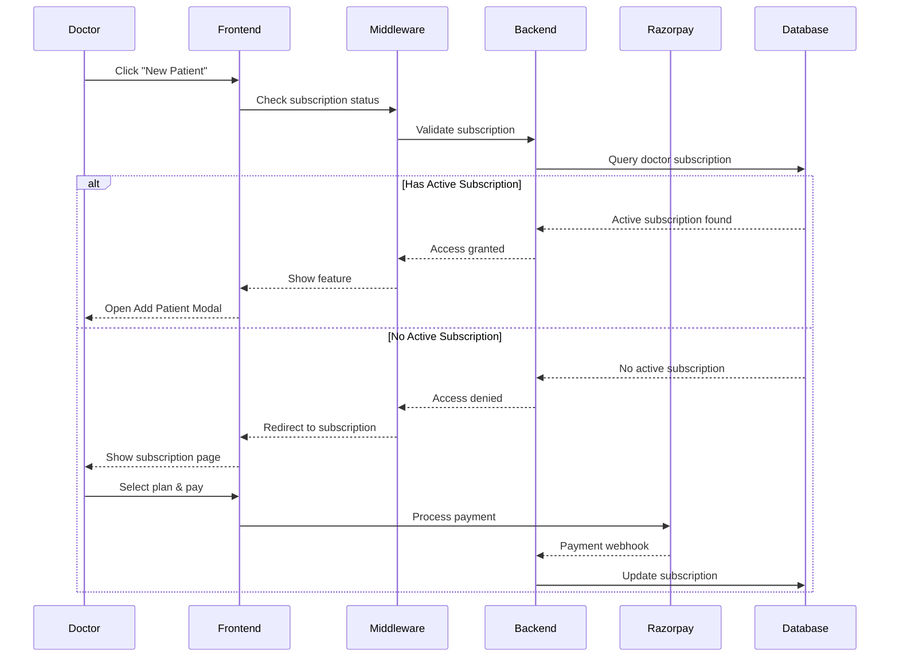

# Design Document

## Overview

The doctor subscription model will be implemented as a comprehensive feature that integrates subscription management, payment processing via Razorpay, and access control throughout the application. The system will extend the existing Doctor model with subscription-related fields and implement middleware for feature access control.

## Architecture

### High-Level Architecture



### Component Interaction Flow



## Components and Interfaces

### 1. Database Schema Extensions

#### Extended Doctor Model
```typescript
// Add to existing Doctor model in schema.prisma
model Doctor {
  // ... existing fields
  subscription_status    SubscriptionStatus @default(INACTIVE)
  subscription_plan      SubscriptionPlan?
  subscription_start     DateTime?
  subscription_end       DateTime?
  razorpay_customer_id   String?
  
  subscriptions          Subscription[]
  payment_transactions   PaymentTransaction[]
}

enum SubscriptionStatus {
  ACTIVE
  INACTIVE
  EXPIRED
  CANCELLED
  GRACE_PERIOD
}

enum SubscriptionPlan {
  MONTHLY
  YEARLY
}
```

#### New Subscription Model
```typescript
model Subscription {
  id                    String            @id @default(uuid())
  doctor_id             String
  plan                  SubscriptionPlan
  status                SubscriptionStatus
  start_date            DateTime
  end_date              DateTime
  razorpay_subscription_id String?
  amount                Int
  currency              String           @default("INR")
  auto_renew            Boolean          @default(true)
  cancelled_at          DateTime?
  
  doctor                Doctor           @relation(fields: [doctor_id], references: [id])
  payment_transactions  PaymentTransaction[]
  
  createdAt             DateTime         @default(now())
  updatedAt             DateTime         @updatedAt
}
```

#### Payment Transaction Model
```typescript
model PaymentTransaction {
  id                    String           @id @default(uuid())
  doctor_id             String
  subscription_id       String?
  razorpay_payment_id   String           @unique
  razorpay_order_id     String
  amount                Int
  currency              String           @default("INR")
  status                PaymentStatus
  payment_method        String?
  failure_reason        String?
  
  doctor                Doctor           @relation(fields: [doctor_id], references: [id])
  subscription          Subscription?    @relation(fields: [subscription_id], references: [id])
  
  createdAt             DateTime         @default(now())
  updatedAt             DateTime         @updatedAt
}

enum PaymentStatus {
  PENDING
  SUCCESS
  FAILED
  REFUNDED
}
```

### 2. Backend API Endpoints

#### Subscription Controller
```typescript
// /api/subscription
GET    /subscription/status          // Get current subscription status
POST   /subscription/create          // Create new subscription
POST   /subscription/upgrade         // Upgrade subscription plan
POST   /subscription/cancel          // Cancel subscription
GET    /subscription/history         // Get payment history

// /api/payment
POST   /payment/create-order         // Create Razorpay order
POST   /payment/verify               // Verify payment signature
POST   /payment/webhook              // Handle Razorpay webhooks
```

#### Subscription Service
```typescript
interface SubscriptionService {
  checkSubscriptionStatus(doctorId: string): Promise<SubscriptionStatus>
  createSubscription(doctorId: string, plan: SubscriptionPlan): Promise<Subscription>
  upgradeSubscription(doctorId: string, newPlan: SubscriptionPlan): Promise<Subscription>
  cancelSubscription(doctorId: string): Promise<void>
  processPaymentWebhook(payload: RazorpayWebhook): Promise<void>
  sendExpiryReminders(): Promise<void>
}
```

### 3. Frontend Components

#### Subscription Gate Component
```typescript
interface SubscriptionGateProps {
  feature: 'NEW_PATIENT' | 'CREATE_PRESCRIPTION' | 'SEND_REMINDER'
  children: React.ReactNode
  fallback?: React.ReactNode
}

// Usage: Wrap premium features
<SubscriptionGate feature="NEW_PATIENT">
  <Button onClick={openAddPatientModal}>New Patient</Button>
</SubscriptionGate>
```

#### Subscription Page Components
- `SubscriptionPlans`: Display available plans with pricing
- `PaymentForm`: Razorpay payment integration
- `SubscriptionStatus`: Show current subscription details
- `PaymentHistory`: Display transaction history
- `SubscriptionSettings`: Manage subscription preferences

### 4. Middleware Implementation

#### Subscription Middleware (Backend)
```typescript
interface SubscriptionMiddleware {
  checkFeatureAccess(doctorId: string, feature: string): Promise<boolean>
  requireActiveSubscription(req: Request, res: Response, next: NextFunction): void
}
```

#### Feature Gate Hook (Frontend)
```typescript
interface UseSubscriptionGate {
  hasAccess: (feature: string) => boolean
  subscriptionStatus: SubscriptionStatus
  redirectToSubscription: () => void
  isLoading: boolean
}
```

## Data Models

### Subscription Plans Configuration
```typescript
const SUBSCRIPTION_PLANS = {
  MONTHLY: {
    id: 'monthly',
    name: 'Monthly Plan',
    price: 9900, // in paise (₹99)
    duration: 30, // days
    features: ['unlimited_patients', 'prescriptions', 'reminders']
  },
  YEARLY: {
    id: 'yearly',
    name: 'Yearly Plan', 
    price: 99900, // in paise (₹999)
    duration: 365, // days
    features: ['unlimited_patients', 'prescriptions', 'reminders', 'priority_support']
  }
}
```

### Razorpay Integration Models
```typescript
interface RazorpayOrder {
  id: string
  amount: number
  currency: string
  receipt: string
  status: string
}

interface RazorpayPayment {
  id: string
  order_id: string
  amount: number
  currency: string
  status: string
  method: string
}

interface RazorpayWebhook {
  event: string
  payload: {
    payment: RazorpayPayment
    order: RazorpayOrder
  }
}
```

## Error Handling

### Payment Error Scenarios
1. **Payment Gateway Timeout**: Retry mechanism with exponential backoff
2. **Invalid Payment Signature**: Log security incident and reject payment
3. **Webhook Delivery Failure**: Implement webhook retry with dead letter queue
4. **Subscription Expiry**: Grace period handling with feature degradation
5. **Payment Method Failure**: Email notification with retry options

### Error Response Format
```typescript
interface ErrorResponse {
  error: {
    code: string
    message: string
    details?: any
  }
  timestamp: string
  requestId: string
}
```

## Testing Strategy

### Unit Tests
- Subscription service methods
- Payment verification logic
- Access control middleware
- Database model validations

### Integration Tests
- Razorpay payment flow end-to-end
- Webhook processing
- Subscription status updates
- Feature access control

### Frontend Tests
- Subscription gate component behavior
- Payment form validation
- Subscription page navigation
- Error state handling

### Test Data Setup
```typescript
const TEST_SCENARIOS = {
  ACTIVE_MONTHLY: { plan: 'MONTHLY', status: 'ACTIVE', end_date: '+30 days' },
  EXPIRED_SUBSCRIPTION: { plan: 'MONTHLY', status: 'EXPIRED', end_date: '-1 day' },
  GRACE_PERIOD: { plan: 'YEARLY', status: 'GRACE_PERIOD', end_date: '-3 days' },
  NO_SUBSCRIPTION: { status: 'INACTIVE' }
}
```

### Security Considerations

1. **API Key Management**: Store Razorpay keys in environment variables
2. **Webhook Signature Verification**: Validate all incoming webhooks
3. **Payment Data Encryption**: Encrypt sensitive payment information
4. **Access Token Validation**: Verify JWT tokens for subscription checks
5. **Rate Limiting**: Implement rate limits on payment endpoints
6. **Audit Logging**: Log all subscription and payment events

### Performance Optimizations

1. **Subscription Caching**: Cache subscription status in Redis
2. **Database Indexing**: Index subscription_end and doctor_id fields
3. **Webhook Processing**: Use background jobs for webhook processing
4. **Frontend Optimization**: Lazy load subscription components
5. **API Response Caching**: Cache subscription plans and pricing

### Monitoring and Analytics

1. **Payment Success Rate**: Track payment completion rates
2. **Subscription Churn**: Monitor cancellation patterns
3. **Feature Usage**: Track premium feature adoption
4. **Revenue Metrics**: Monitor MRR and ARR
5. **Error Rates**: Alert on payment processing failures